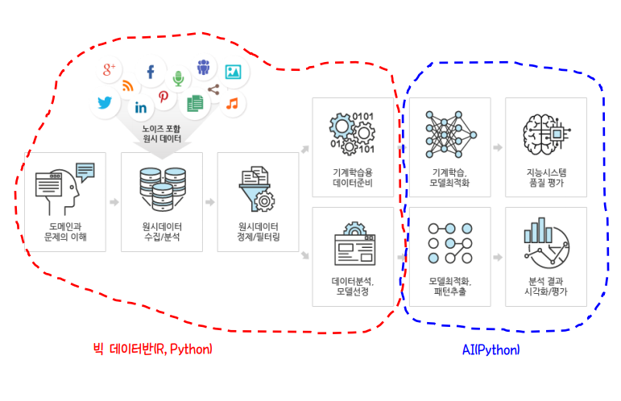
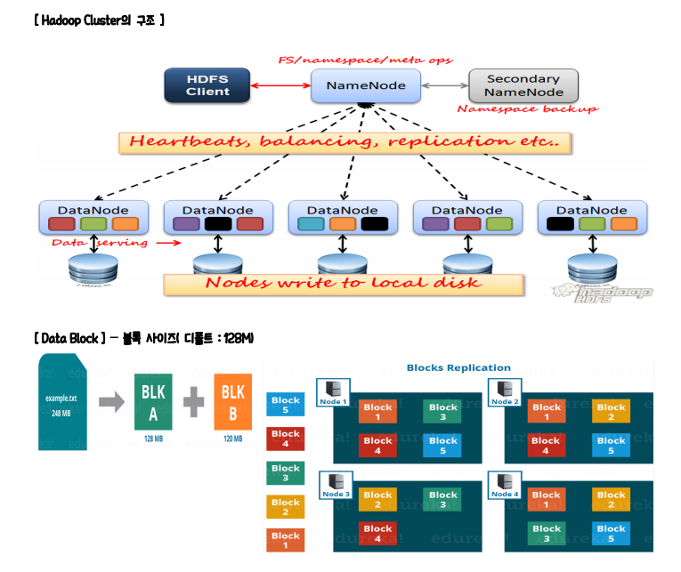
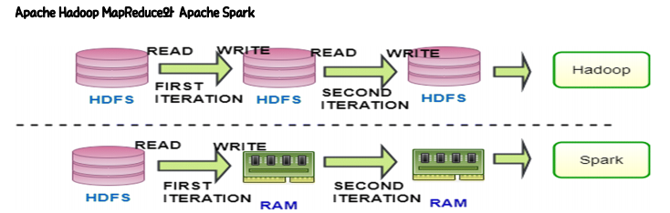
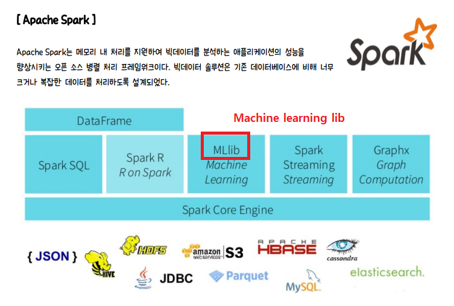

11/18

빅데이터 분석 순환 교육

- R프로그래밍

- 데이터 수집(R/ Python, Maria DB, Mango DB)

  - sns , 공공 data, 크롤링

- 데이터 전처리 (R, Python, SQL)

- 데이터분석, 시각화 (R, Python, Spark)

  전공 프로젝트 : 웹 + 데이터 수집/ 분석/ 시각화 프로젝트

  - R / Python 1번씩

- AWS 에 Maria DB, Mango DB, Spark 설치되어 있음.

데이터분석 : 상관분석 / 회귀분석/ 분류분석/ 군집분석/ 연관분석 배움

하둡 

분산 컴퓨팅 시스템

- '블럭' 단위로 분산하면서 쪼개서 저장, 분산된 데이터를 관리해주는 hadoop
  - HDFS 방식

- MapReduce : 

spark (분산 저장은 hadoop , 분산 처리는 spark)

hadoop에서 수행 속도 개선

처리할 데이터량이 많을 경우 데이터 분석팀에서 spark로 처리할 수 있다.

spark 사용할 경우 인스턴스 열어줌.

